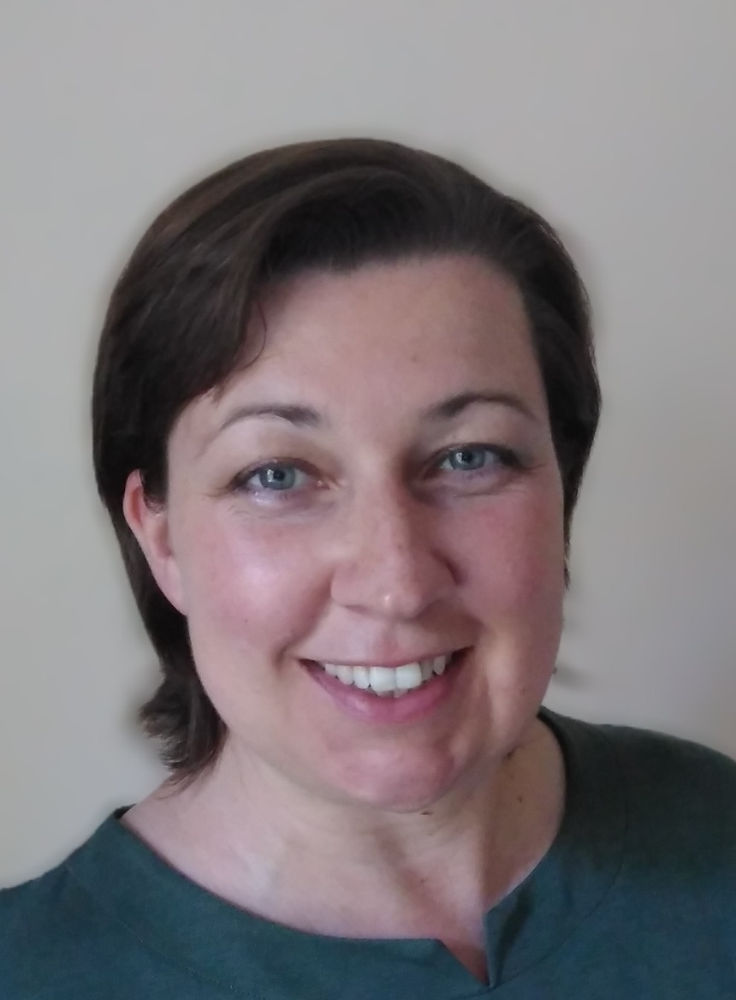

::: {.hero}
{.profile-img}

[Dr. Seraphine F. Maerz]{.name}

[Computational social science · political communication · digital authoritarianism · democratic resilience]{.tagline}

[Senior Lecturer in Political Science (Research Methods)]{.position}

[School of Social and Political Science, University of Melbourne]{.affiliation}

[Australian Research Council DECRA Fellow]{.credential}

::: {.contact-links}
[LinkedIn](https://www.linkedin.com/in/dr-seraphine-f-maerz-410286327/) · [GitHub](https://github.com/SeraphineM) · [Google Scholar](https://scholar.google.com/citations?user=Bp3m4N0AAAAJ&hl=de)
:::
:::

::: {.about}
I am a computational social scientist and Senior Lecturer in Political Science (Research Methods) at the [University of Melbourne](https://findanexpert.unimelb.edu.au/profile/1051597-seraphine-maerz). My work pairs large-scale text and digital behavioural data with automated text analysis and large language models (LLMs) to study political communication and democratic resilience. Before Melbourne, I held positions as Assistant Professor at the [Goethe University](https://www.goethe-university-frankfurt.de/en?locale=en) in Frankfurt am Main, Germany, and the [Varieties of Democracy (V-Dem) Institute](https://www.v-dem.net/) in Gothenburg, Sweden.

My research interests are:

- Democracy, authoritarianism, autocratization
- Political communication, authoritarian informationalism
- Quantitative and computational methods, large language models (LLMs)

I am co-founder and convenor of [QuantLab](https://quantilab.github.io), a network group aiming to bring together social scientists at the University of Melbourne and beyond to share insights in cutting-edge computational and AI-assisted methods and research. I offer online workshops on how to use [LLMs for text analysis](https://instats.org/expert/seraphine-maerz-2?view=Seminars). Check out our new [quallmer R package](https://quallmer.github.io/quallmer/) - an easy-to-use toolbox for qualitative researchers to quickly apply LLMs to code and analyze their data.
:::

## CV {#cv}

[Download CV as PDF](cv/CV.pdf){.download-link}

```{=html}
<iframe src="cv/CV.pdf" width="100%" height="800px" style="border: none; border-radius: 4px;"></iframe>
```

## Publications {#publications}

See also my [Google Scholar profile](https://scholar.google.com/citations?user=Bp3m4N0AAAAJ&hl=de).

#### Books and special issues

- Seraphine F. Maerz and Kenneth Benoit. *AI-Assisted Content Analysis*. SAGE Publications, under contract.

- Lisa Garbe and Seraphine F. Maerz (Guest Editors). The rise of authoritarian informationalism: Escalating surveillance, manipulation, and control. Introduction to a special issue. *Democratization*, 33(1), 1–18, 2026. [Access here](https://www.tandfonline.com/doi/full/10.1080/13510347.2025.2579105).

#### In peer-reviewed journals

- Seraphine F. Maerz, Dean G. Schafer, and Carsten Q. Schneider. Listening to leaders: Illiberal speech as a symptom of democratic decline. *Comparative Political Studies*, Online First, 2026. [Access here](https://journals.sagepub.com/doi/10.1177/00104140261487983).

- Seraphine F. Maerz. How practices of digital authoritarianism harm democracy. *Democratization*, 33(1), 163–190, 2026. [Access here](https://www.tandfonline.com/doi/full/10.1080/13510347.2025.2553826).

- Lisa Garbe, Seraphine F. Maerz, and Tina Freyburg. Authoritarian collaboration and repression in the digital age. *Democratization*, 33(1), 85–108, 2026. [Access here](https://www.tandfonline.com/doi/full/10.1080/13510347.2024.2442377).

- Dean G. Schafer, Seraphine F. Maerz, Carsten Q. Schneider, and Alexandra Krasnokutskaya. "Strongmen" don't redistribute: Illiberal leaders on the right and worsening economic inequality. *Politics and Governance*, 13, 1–24, 2025. [Access here](https://www.cogitatiopress.com/politicsandgovernance/article/view/9812).

- Amanda B. Edgell, Jean Lachapelle, and Seraphine F. Maerz. Achieving transparency, traceability, and readability with human-coded data. *PS: Political Science and Politics*, 58(2), 346–351, 2025. [Access here](https://doi.org/10.1017/S1049096524000714).

- Seraphine F. Maerz, Amanda B. Edgell, Matthew C. Wilson, Sebastian Hellmeier, and Staffan I. Lindberg. Episodes of regime transformation. *Journal of Peace Research*, 61(6), 967–984, 2024. [Access here](https://journals.sagepub.com/doi/10.1177/00223433231168192).

- Matthew C. Wilson, Juraj Medzihorsky, Seraphine F. Maerz, Anna Lührmann, Patrik Lindenfors, Amanda B. Edgell, Vanessa A. Boese, and Staffan I. Lindberg. Episodes of liberalization in autocracies: A new approach to quantitatively studying democratization. *Political Science Research and Methods*, 11(3), 501–520, 2023. [Access here](https://www.cambridge.org/core/journals/political-science-research-and-methods/article/episodes-of-liberalization-in-autocracies-a-new-approach-to-quantitatively-studying-democratization/CD86064BF11FEEC8BD9354921E3C9BE3).

- Amanda B. Edgell, Vanessa A. Boese, Seraphine F. Maerz, Patrik Lindenfors, and Staffan I. Lindberg. Establishing pathways to democracy using domination analysis. *British Journal of Political Science*, 52(3), 1203–1209, 2022. [Access here](https://doi.org/10.1017/S000712342100020X).

- Amanda B. Edgell, Jean Lachapelle, Anna Lührmann, and Seraphine F. Maerz. Pandemic backsliding: Violations of democratic standards during Covid-19. *Social Science and Medicine*, 285, 1465–1471, 2021. [Access here](https://www.sciencedirect.com/science/article/pii/S0277953621005761).

- Vanessa A. Boese, Amanda B. Edgell, Sebastian Hellmeier, Seraphine F. Maerz, and Staffan I. Lindberg. How democracies prevail: Democratic resilience as a two-stage process. *Democratization*, 28(5), 885–907, 2021. [Access here](https://www.tandfonline.com/doi/full/10.1080/13510347.2021.1891413).

- Sebastian Hellmeier, Rowan Cole, Sandra Grahn, Palina Kolvani, Jean Lachapelle, Anna Lührmann, Seraphine F. Maerz, Shreeya Pillai, and Staffan I. Lindberg. State of the world 2020: Autocratization turns viral. *Democratization*, 28(6), 1053–1074, 2021. [Access here](https://doi.org/10.1080/13510347.2021.1922390).

- Seraphine F. Maerz, Anna Lührmann, Sebastian Hellmeier, Sandra Grahn, and Staffan I. Lindberg. State of the world 2019: Autocratization surges – resistance grows. *Democratization*, 27(6), 909–927, 2020. [Access here](https://www.tandfonline.com/doi/full/10.1080/13510347.2020.1758670).

- Seraphine F. Maerz. The many faces of authoritarian persistence: A set-theory perspective on the survival strategies of authoritarian regimes. *Government and Opposition*, 55(1), 64–87, 2020. [Access here](https://www.cambridge.org/core/journals/government-and-opposition/article/many-faces-of-authoritarian-persistence-a-settheory-perspective-on-the-survival-strategies-of-authoritarian-regimes/7FCA47E0A5C484EB18A0744E04641886).

- Seraphine F. Maerz and Carsten Q. Schneider. Comparing public communication in democracies and autocracies: Automated text analyses of speeches by heads of government. *Quality and Quantity*, 54, 517–545, 2019. [Access here](http://link.springer.com/article/10.1007/s11135-019-00885-7).

- Seraphine F. Maerz. Simulating pluralism: The language of democracy in hegemonic authoritarianism. *Political Research Exchange*, 1(1), 1–23, 2019. [Access here](https://doi.org/10.1080/2474736X.2019.1605834).

- Seraphine F. Maerz. Ma'naviyat in Uzbekistan: An ideological extrication from its Soviet past? *Journal of Political Ideologies*, 23(2), 205–222, 2018. [Access here](http://dx.doi.org/10.1080/13569317.2018.1419448).

- Carsten Q. Schneider and Seraphine F. Maerz. Legitimation, cooptation, and repression and the survival of electoral autocracies. *Zeitschrift für Vergleichende Politikwissenschaft*, 11(2), 213–235, 2017. [Access here](http://link.springer.com/article/10.1007/s12286-017-0332-2).

- Seraphine F. Maerz. The electronic face of authoritarianism: E-government as a tool for gaining legitimacy in competitive and non-competitive regimes. *Government Information Quarterly*, 33(4), 727–735, 2016. [Access here](http://www.sciencedirect.com/science/article/pii/S0740624X16301484).

#### V-Dem Democracy Reports

- Nazifa Alizada, Rowan Cole, Lisa Gastaldi, Sandra Grahn, Sebastian Hellmeier, Palina Kolvani, Jean Lachapelle, Anna Lührmann, Seraphine F. Maerz, Shreeya Pillai, and Staffan I. Lindberg. *Autocratization turns viral. Democracy Report 2021*. V-Dem Institute, 2021. [Access here](https://www.v-dem.net/publications/democracy-reports/).

- Anna Lührmann, Seraphine F. Maerz, Sandra Grahn, Nazifa Alizada, Lisa Gastaldi, Sebastian Hellmeier, Garry Hindle, and Staffan I. Lindberg. *Autocratization surges – resistance grows. Democracy Report 2020*. V-Dem Institute, 2020. [Access here](https://www.v-dem.net/publications/democracy-reports/).

#### Policy briefs

- Seraphine F. Maerz, Svitlana Chernykh, and Constanza Sanhueza Petrarca. Addressing AI-powered threats to democracy. Policy report for the Robert Schumann Center (EUI) and European Commission, 2026. *Commissioned work*. [Access here](https://cadmus.eui.eu/entities/publication/b851f50c-5208-4e2b-a766-dba5f1b7bc3d).

- Lisa Garbe, Seraphine F. Maerz, and Tina Freyburg. Wie Autokratien im Digitalen kooperieren – und warum das Folgen für die Informationsfreiheit hat. *De Facto*, 2026. [Access here](https://www.defacto.expert/2026/02/04/wie-autokratien-im-digitalen-kooperieren-und-warum-das-folgen-fuer-die-informationsfreiheit-hat/).

- Seraphine F. Maerz, Amanda B. Edgell, and Jean Lachapelle. "Pandemic Backsliding" – Demokratien im Ausnahmezustand während COVID-19. *De Facto*, 2022. [Access here](https://www.defacto.expert/2022/03/29/pandemic-backsliding-demokratien-im-ausnahmezustand-waehrend-covid-19/).

- Seraphine F. Maerz and Valeriya Mechkova. Policy report for USAID on e-government, 2021. *Commissioned work*.

- Amanda B. Edgell, Matthew C. Wilson, and Seraphine F. Maerz. Episodes of regime transformation: Assessing democratization and autocratization since 1900. *APSA Comparative Politics Newsletter*, Spring 2021. [Access here](https://www.comparativepoliticsnewsletter.org/wp-content/uploads/2021/05/2021_spring.pdf).

- Palina Kolvani, Martin Lundstedt, Seraphine F. Maerz, Anna Lührmann, Jean Lachapelle, Sandra Grahn, and Amanda B. Edgell. Pandemic backsliding: Democracy and disinformation seven months into the Covid-19 pandemic. Policy Brief 25, V-Dem Institute, 2020. [Access here](https://www.v-dem.net/publications/briefing-papers/).

- Amanda B. Edgell, Sandra Grahn, Jean Lachapelle, Anna Lührmann, and Seraphine F. Maerz. An update on pandemic backsliding: Democracy four months after the beginning of the Covid-19 pandemic. Policy Brief 24, V-Dem Institute, 2020. [Access here](https://www.v-dem.net/publications/briefing-papers/).

- Anna Lührmann, Amanda B. Edgell, and Seraphine F. Maerz. Pandemic backsliding: Does Covid-19 put democracy at risk? Policy Brief 23, V-Dem Institute, 2020. [Access here](https://www.v-dem.net/publications/briefing-papers/).

#### Book chapters and other publications

- Sebastian Stier and Seraphine F. Maerz. Computational methods. In *Handbook of Comparative Politics* (Springer), edited by Marianne Kneuer et al., forthcoming.

- Seraphine F. Maerz. Tech-Autokratie: Wie digitale Macht politische Systeme verändert. *Aus Politik und Zeitgeschichte (APuZ)*, 35–37/2026 ("Autoritarismus"), Bundeszentrale für politische Bildung (Federal Agency for Civic Education), 2026. [Access here](https://www.bpb.de/shop/zeitschriften/apuz/autoritarismus-2026/).

- Seraphine F. Maerz. The Internet and autocratization. Chapter 15, pp. 175–187, in *The Routledge Handbook of Autocratization*, edited by Aurel Croissant and Luca Tomini, 2024.

- Seraphine F. Maerz, Felix Schulte, and Christoph Trinn. Autocratization and political conflict. Chapter 31, pp. 380–393, in *The Routledge Handbook of Autocratization*, edited by Aurel Croissant and Luca Tomini, 2024.

- Vanessa A. Boese-Schlosser, Amanda B. Edgell, Sebastian Hellmeier, Seraphine F. Maerz, Yuko Sato, Matthew C. Wilson, and Staffan I. Lindberg. Identifying episodes of autocratization. Chapter 5, pp. 65–76, in *The Routledge Handbook of Autocratization*, edited by Aurel Croissant and Luca Tomini, 2024.

- Seraphine F. Maerz and Cornelius Puschmann. Text as data for conflict research: A literature survey. Pp. 43–65, in *Computational Conflict Research*, Springer, 2020. Open Access. [Access here](https://link.springer.com/chapter/10.1007/978-3-030-29333-8_3).

- Seraphine F. Maerz. Book review: Peter Rollberg and Marlene Laruelle (eds.), *Mass Media in the Post-Soviet World*. *Europe-Asia Studies*, 71(5), 863–865, 2019. [Access here](https://doi.org/10.1080/09668136.2019.1618575).

- Staffan I. Lindberg, Martin Lundstedt, Nazifa Alizada, Rowan Cole, Lisa Gastaldi, Sandra Grahn, Sebastian Hellmeier, Palina Kolvani, Jean Lachapelle, Anna Lührmann, Seraphine F. Maerz, and Shreeya Pillai. Liberal demokrati i riskzonen – autokratisering blir viral. In K. Abrahamsson, P. Jansson, and T. Åkesson (eds.), *Demokratin Som Bildningsväg*, pp. 269–286. Carlssons Bokförlag, 2022.

- Seraphine F. Maerz, Anna-Luise Kraayvanger, Simone Bahlo, and Barno Aripova. Beim Uloq (1915), Der Zweifel (1935). Translations from Uzbek. In Ingeborg Baldauf et al. (eds.), *Abdulla Qodiriy & seine Zeit. Festschrift für Barno Aripova*. Edition Tethys, 2018.

#### R packages

- Seraphine F. Maerz and Kenneth Benoit. *quallmer* – an R package for qualitative analysis with LLMs, 2026. [Access here](https://quallmer.github.io/quallmer/).

- Seraphine F. Maerz and Kenneth Benoit. *quanteda.llm* – LLM support for quanteda, 2025. [Access here](https://quanteda.github.io/quanteda.llm/).

- Seraphine F. Maerz, Amanda B. Edgell, Sebastian Hellmeier, and Nina Ilchenko. *vdemdata* – an R package to load, explore, and work with the most recent V-Dem (Varieties of Democracy) dataset. V-Dem Project, 2025. [Access here](https://github.com/vdeminstitute/vdemdata).

- Seraphine F. Maerz, Amanda B. Edgell, Joshua Krusell, Laura Maxwell, Sebastian Hellmeier, and Nina Ilchenko. *ERT* – an R package to load, explore, and work with the Episodes of Regime Transformation (ERT) dataset. V-Dem Project, 2025. [Access here](https://github.com/vdeminstitute/ERT).

- Seraphine F. Maerz. *audacola* – an R package to assist with automated data collection and analysis, 2020. [Access here](https://github.com/SeraphineM/audacola).

## Research Projects {#research}

### Words of Warning: How Illiberal Public Discourse Signals Democratic Decline

I am Chief Investigator of an [Australian Research Council (ARC)](https://www.arc.gov.au/) DECRA project (2026-2028) on how illiberal public discourse signals democratic decline. In this project, I analyze large-scale text data from political speeches, parliamentary debates, and social media to investigate shifting public discourses in several democracies. For further information about this project, see [here.](https://findanexpert.unimelb.edu.au/project/25-3041-words-of-warning--how-illiberal-public-discourse-signals-democratic-decline)

### Smart Authoritarianism? Comparing the Internet Strategies of Authoritarian Regimes

I was Principal Investigator and Project Leader of a project on authoritarian Internet strategies (2021-2024), the project was funded by the [German Research Foundation (DFG)](https://www.dfg.de/en/index.jsp) and affiliated with the Institute of Political Science at the Goethe University Frankfurt (Germany), see also [here](https://www.fb03.uni-frankfurt.de/108463498/Schwerpunkt_Methoden_der_Qualitativen_Empirischen_Sozialforschung).
Together with my team and in collaboration with Tina Freyburg (University of St. Gallen) and Lisa Garbe (WZB), we released TOSCO2.0, an updated dataset on ownership structures of Internet Service Providers (ISPs), more information [here](https://tosco.shinyapps.io/data/).

### Neo-Authoritarianism in Europe and the Liberal Democratic Response (AUTHLIB)

I was a participating researcher in the EU Horizon Europe project AUTHLIB. The project was coordinated by the Central European University (CEU), other participating institutions were Charles University, German Marshall Fund, Sciences Po, Scuola Normale Superiore, University of Social Sciences and Humanities in Warsaw, University of Oxford, and the University of Vienna. See also the [project's website](http://www.authlib.eu/).

### Pandemic Backsliding: Democracy during COVID-19

I was Principal Investigator (together with Anna Lührmann, Amanda B. Edgell, and Jean Lachapelle) of a project on violations of democratic standards for emergency responses during the COVID-19 pandemic, the project was funded by the Swedish Ministry of Foreign Affairs (2020/2021). For further information about this project, see [here.](https://www.v-dem.net/pandem.html)

## Datasets {#datasets}

### Interactive dashboards

::: {.dash-grid}

::: {.dash-card}
#### [Illiberal Speech Index (ISI) Dashboard](https://validation.shinyapps.io/speeches/)

Companion to the *Comparative Political Studies* article "Listening to Leaders". Maps illiberal rhetoric across 161,698 paragraphs from 28,232 speeches by 452 political leaders in 123 countries (1989–2024), each scored from 0 (liberal) to 10 (illiberal). Filter by country and period, switch between peak ("high water mark") and mean measures, overlay the Electoral Democracy Index, and hover any point to read the underlying speech excerpt. Also links to the complete replication package.

[with Dean Schafer and Carsten Q. Schneider]{.dash-meta}
[Launch dashboard →](https://validation.shinyapps.io/speeches/){.dash-launch}
:::

::: {.dash-card}
#### [TOSCO Dashboard](https://tosco.shinyapps.io/data/)

Data on the ownership of Internet service providers (ISPs) worldwide, with tools to explore ownership structures and the degree of state control over ISPs.

[with the TOSCO team]{.dash-meta}
[Launch dashboard →](https://tosco.shinyapps.io/data/){.dash-launch}
:::

::: {.dash-card}
#### [ERT Validation App](https://episodes.shinyapps.io/validation/)

Lets users flexibly adjust the parameters of the Episodes of Regime Transformation (ERT) dataset and test the validity of the resulting episodes.

[with Sebastian Hellmeier]{.dash-meta}
[Launch app →](https://episodes.shinyapps.io/validation/){.dash-launch}
:::

:::

### Episodes of Regime Transformation (ERT)

Identifies episodes of democratization (liberalizing autocracy, democratic deepening) and autocratization (democratic regression, autocratic regression) in the most recent V-Dem dataset, the dataset is **[freely available here](http://www.github.com/vdeminstitute/ert)**. We also provide the **ERT [R package](http://www.github.com/vdeminstitute/ert)** as a user-friendly tool to flexibly work with the dataset.

Citation: Edgell, Amanda B., Seraphine F. Maerz, Laura Maxwell, Richard Morgan, Juraj Medzihorsky, Matthew C. Wilson, Vanessa A. Boese, Sebastian Hellmeier, Jean Lachapelle, Patrik Lindenfors, Anna Lührmann, and Staffan I. Lindberg. Episodes of Regime Transformation Dataset (v15.0). Varieties of Democracy (V-Dem) Project, 2025.

### TOSCO 2.0

In collaboration with Tina Freyburg (University of St. Gallen) and Lisa Garbe (WZB), we released TOSCO 2.0 (Telecommunications Ownership and Control), an updated dataset on ownership structures of Internet Service Providers (ISPs), more information [here](https://tosco.shinyapps.io/data/).

### Pandemic Backsliding

The Pandemic Backsliding project tracks state responses to Covid-19 and their potential effect on the overall quality of democracy within the country. The current version of the data reflects the situation between March 2020 and June 2021. The data is **[freely available here](https://github.com/vdeminstitute/pandem)**, more information about the project [here](https://www.v-dem.net/pandem.html).

Citation: Edgell, Amanda B., Anna Lührmann, Seraphine F. Maerz, Jean Lachapelle, Sandra Grahn, Ana Flavia Good God, Martin Lundstedt, Natalia Natsika, Palina Kolvani, Paul Bederke, Shreeya Pillai, Stefanie Kaiser, Abdalhadi Alijla, Tiago Fernandes, Hans Tung, Matthew Wilson, and Staffan I. Lindberg. Pandemic Backsliding: Democracy During Covid-19 (PanDem), Version 5, Varieties of Democracy (V-Dem) Project, 2020.

### Varieties of Democracy (V-Dem)

I contributed to Version 11.1. of the Varieties of Democracy (V-Dem) dataset. The V-Dem dataset includes the world's most comprehensive and detailed democracy ratings. The dataset and associated reference documents are **[freely available here](https://www.v-dem.net/data/the-v-dem-dataset/).**

Together with a few colleagues, we put together the **vdemdata [R package](https://github.com/vdeminstitute/vdemdata)** as a user-friendly tool to work with the latest version of the V-Dem dataset.

Citation: Michael Coppedge, John Gerring, Carl Henrik Knutsen, Staffan I. Lindberg, Jan Teorell, David Altman, Michael Bernhard, Agnes Cornell, M. Steven Fish, Lisa Gastaldi, Haakon Gjerløw, Adam Glynn, Allen Hicken, Anna Lührmann, Seraphine F. Maerz, Kyle L. Marquardt, Kelly McMann, Valeriya Mechkova, Pamela Paxton, Daniel Pemstein, Johannes von Römer, Brigitte Seim, Rachel Sigman, Svend-Erik Skaaning, Jeffrey Staton, Aksel Sundström, Eitan Tzelgov, Luca Uberti, Yi-ting Wang, Tore Wig, and Daniel Ziblatt. V-Dem Codebook v11.1, https://www.v-dem.net/. Varieties of Democracy (V-Dem) Project, 2021.

## Teaching {#teaching}

#### Seminars and lectures

-   **University of Melbourne**: Quantitative Methods (PhD), Authoritarian Politics (BA, co-coordinator), Decoding Democracy (BA), Communicating Social Science Research (BA Honours), Researching Politics and Policy (PhD), Applied Political Science Project (BA, incl. R coding seminar)
-   **Goethe University Frankfurt**: Measuring Democracy (MA)
-   **University of Gothenburg**: Varieties of Democracy (MA, co-coordinator)
-   **Bard College Berlin**: Introduction to Statistics (BA), Measuring Democracy and Autocracy (BA)
-   **University of Freiburg**: Democratization & Authoritarianism (BA/MA), Qualitative Methods (MA)
-   **Central European University (CEU)**: Research Design, Set Methods and QCA (Guest lecture), Comparative Politics (TA), Central Asia (TA)

#### Online methods workshops

- [*ekomex* 2027](https://afww.uni-konstanz.de/en/komex/konstanz-methods-excellence-workshops), University of Konstanz: "Introduction to AI-driven Text Analysis" & "Fine-Tuning Large Language Models" (upcoming)
- [*ekomex* 2026](https://afww.uni-konstanz.de/en/komex/konstanz-methods-excellence-workshops), University of Konstanz: "Introduction to AI-driven Text Analysis" & "Fine-Tuning Large Language Models"
- [AI-Assisted Content Analysis](https://instats.org/seminar/ai-assisted-content-analysis) (with K. Benoit), Instats platform, 2026
- [AI-Powered Qualitative Analysis in R 2.0](https://doi.org/10.61700/X8FWPVNRRWHT12277) (with K. Benoit), Instats platform, 2026
- [Tuning LLMs for Text Analysis](https://doi.org/10.61700/YW2IS8JTEGGA12277), Instats platform, 2026
- [Using AI for Text Analysis: An Introduction](https://doi.org/10.61700/TI5UEXUI5ILRD1663), Instats platform, 2025
- [Using AI for Text Analysis: Advanced Applications](https://doi.org/10.61700/NQUMT3VU2ZQ3K1816), Instats platform, 2025
- [Quarto in RStudio: Writing Reproducible & Dynamic Research Papers](https://doi.org/10.61700/PDEAAEFQ62N681556), Instats platform, 2024

#### Free tutorials and webinars

Through [QuantLab Sharezone](https://quantilab.github.io/sharezone/), I contribute free educational resources on quantitative methods and computational techniques. The hub offers step-by-step guides, recorded webinars, and downloadable materials from QuantLunch sessions, covering topics such as text analysis with large language models (using R packages like *quallmer* and *quanteda.llm*), reproducible research with Quarto and RStudio, GitHub collaboration, and building academic websites.

#### Supervision

- PhD: 3 current (University of Melbourne)
- PhD external examiner: 2 completed (Université Libre de Bruxelles, Sapienza Università di Roma)
- MA: 4 completed (University of Gothenburg)
- Honours: 2 completed (University of Melbourne)

#### Further information

In 2016, I graduated from the [CTL Program](https://ctl.ceu.edu/) for [Excellence in Teaching in Higher Education](https://drive.google.com/open?id=1KXPcd8kNd5nVi4Ly4i94Nl_SExn5GMFa) at CEU. Contact me for further material such as my teaching philosophy, sample syllabi, slides or course evaluations.
